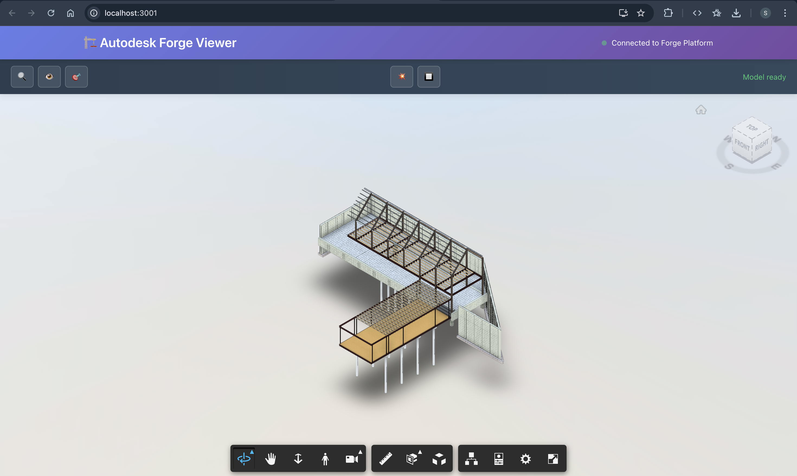
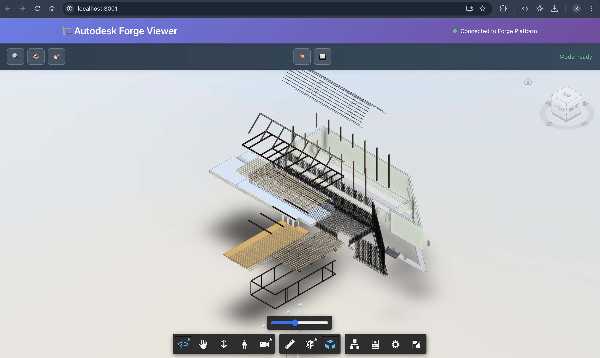

# 🏗️ Autodesk Forge Viewer React App

A modern React application with TypeScript that displays 3D models using the Autodesk Forge Viewer, featuring a custom toolbar and your uploaded Revit file.


## 🚀 Quick Start

```bash
# Start the development server
npm start
```

**Your app will open at: http://localhost:3000**

## 🎮 Interactive Controls

### Custom Toolbar
- 🔍 **Fit to View** - Centers and scales the model
- 👁️ **Show All** - Displays all hidden elements  
- 🎯 **Isolate Selection** - Focuses on selected elements
- 💥 **Explode/Unexplode** - Exploded view of the model
- 🔲 **Toggle Wireframe** - Switches rendering modes

### Mouse Controls
- **Left Click + Drag** - Rotate the model
- **Right Click + Drag** - Pan around
- **Mouse Wheel** - Zoom in/out
- **Click Elements** - Select model parts

## 📁 Key Files

```
src/
├── ForgeViewer.tsx         # Main 3D viewer component
├── ForgeViewer.css         # Styling and animations
├── App.tsx                 # Application shell
└── services/
    └── ForgeAuthService.ts # Autodesk authentication
```

## 🔧 Model Details

- **File**: `rstbasicsampleproject.rvt` 
- **Size**: 6.34 MB
- **Format**: Autodesk Revit
- **Status**: ✅ Ready to view
- **URN**: `dXJu...vnQ=` (pre-configured)

## 🎯 Next Steps

1. **Run the app**: `npm start`
2. **Explore your model**: Use toolbar controls
3. **Customize**: Edit components for your needs
4. **Deploy**: `npm run build` for production

## Screenshots:

| Forge Viewer Main | Custom Toolbar |
|------------------|---------------|
|  |  |

## 🔧 Advanced Features

### Add Custom Functions
Edit `src/ForgeViewer.tsx`:

```typescript
const customFeature = () => {
  if (viewer) {
    // Your custom functionality
    viewer.getProperties(dbId, console.log);
  }
};
```

### Model Events
Listen to viewer events:

```typescript
viewer.addEventListener(Autodesk.Viewing.SELECTION_CHANGED_EVENT, (event) => {
  console.log('Selected:', event.dbIdArray);
});
```

## 🌐 Production Ready

### Build for Production
```bash
npm run build
```

### Security Note
For production, move authentication to your backend server.

---

**🎉 Your 3D Revit model is ready to explore in the browser!**
